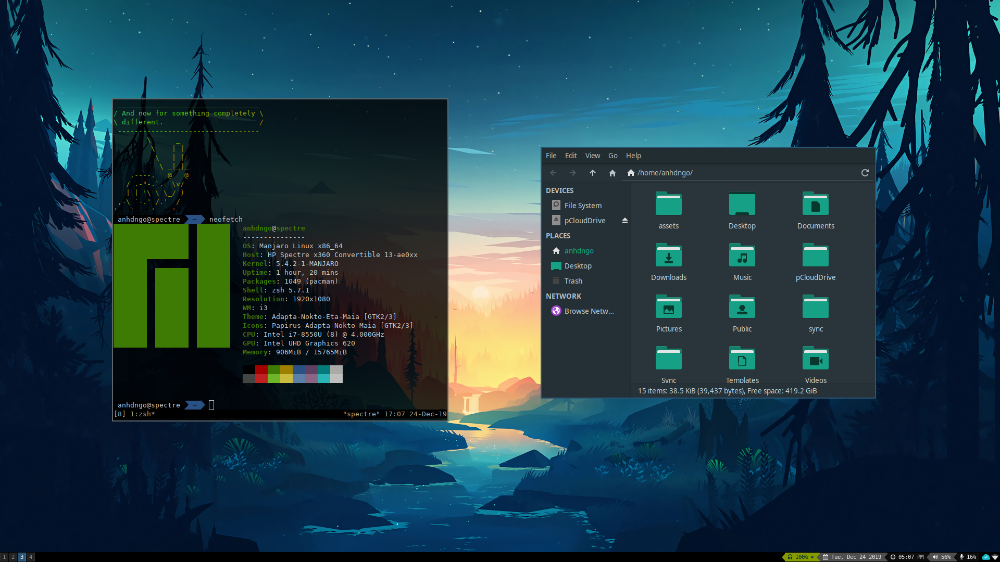

# linux-configs
Scripts and configurations to install on a new linux machine to get to my familiar workflow.

## Setup
First, clone this repo to your home directory.
```
cd ~
git clone https://github.com/anhdngo/linux-configs.git ~/.linux-configs 
```
This repo was built primarily for [Manjaro i3](https://manjaro.org/download/community/i3/) and [Xubuntu](https://xubuntu.org/), the two distros I use most. To install on an Arch-based distro, please follow Manjaro instructions, and for Debian-based distros please use Xubuntu instructions.
#### Manjaro i3
```
make manjaro
```
#### Xubuntu
```
make xubuntu
```

## Sync Assets
#### Wallpapers
To get wallpapers working, change the ```$PICTURES``` path in ```dotfiles/.profile``` to your pictures folder, and place wallpapers in $PICTURES/wallpapers. i3 will randomly rotate through wallpapers.  
#### Workspace
Create a ```~/workspace``` directory, each with a ```##-[A-z0-9]*``` filename. You can now use ```cws``` to navigate to workspace, and ```cws ##``` to navigate to the specific numbered folder.
#### Vimwiki
The vimwiki folder should be stored in ```~/vimwiki```, and vimwiki can be quickly opened using ```vw```

## Technologies Used
Distro: Manjaro  
DE/WM: i3  
DM: LightDM  
i3bar: bumblebee-status  
shell: zsh + [oh-my-zsh](https://github.com/ohmyzsh/ohmyzsh)  
terminal: terminator  
multiplexer: tmux  
file manager: thunar/ranger  

### Screenshot


### Side Notes
To set lightdm background, copy wallpaper to `/usr/share/backgrounds`, edit /etc/lightdm/\*-greeter.conf to use wallpaper, and set user-wallpaper=false
